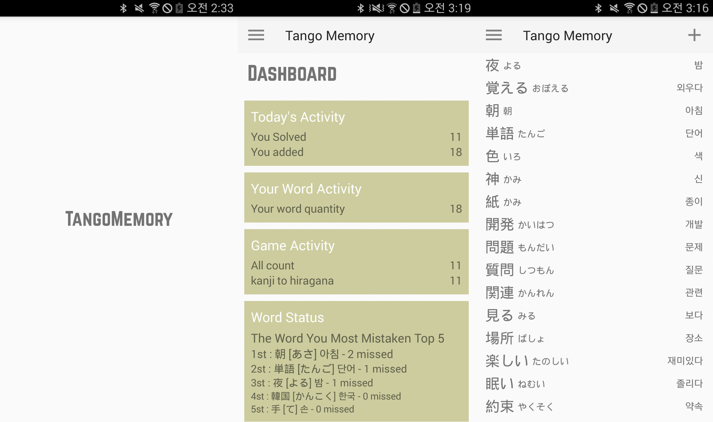

# Tango Memory

일본어 단어를 효과적으로 암기하세요! (개발중)

> 
> 

## 소개

일본어 단어 암기 어플리케이션입니다.

1. 유저만의 단어장이 제공되며 원하는 일본어 단어를 입력하여 넣을 수 있습니다.
2. 한자를 히라가나 표기로 변환하는 게임이 있습니다.
3. 통계를 확인할 수 있습니다

#### 통계 내용:
- 각각의 단어의 게임 정답률
- 게임 오답 횟수가 높은 5개 단어
- 오늘/어제의 등록 단어 갯수
- 게임 플레이 횟수
